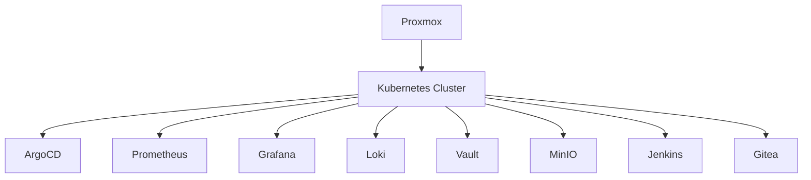

# 🏠 DevOps Homelab

> Personal Platform Engineering Lab focused on Kubernetes, GitOps, Observability, Security and Self-Hosted Infrastructure.

---

## 🎯 Purpose

This repository showcases continuous learning, experimentation and hands-on platform engineering outside production environments.

## 🏗 Homelab Architecture

## 🔧 Technologies

### Infrastructure
- Proxmox
- Linux
- Docker
- Kubernetes

### GitOps
- ArgoCD
- Helm
- GitHub Actions

### Observability
- Prometheus
- Grafana
- Loki
- OpenTelemetry

### Security
- Vault
- RBAC
- TLS
- Secret Management

### DevOps Tooling
- Jenkins
- Gitea
- MinIO

## 🚀 Learning Objectives

- Kubernetes Administration
- GitOps Workflows
- Infrastructure Automation
- Observability Engineering
- Security Best Practices
- Site Reliability Engineering

## 📈 Why This Matters

A homelab demonstrates:

- Passion for technology
- Continuous learning
- Real-world experimentation
- Problem-solving mindset
- Platform Engineering skills

## 🗺 Roadmap

- [ ] Kubernetes Cluster Setup
- [ ] GitOps Bootstrap
- [ ] Monitoring Stack
- [ ] Logging Stack
- [ ] Secrets Management
- [ ] Backup Strategy
- [ ] Security Hardening
- [ ] Disaster Recovery

## 👨‍💻 Author

Kanakaraj Vetti
DevOps Engineer | Platform Engineer